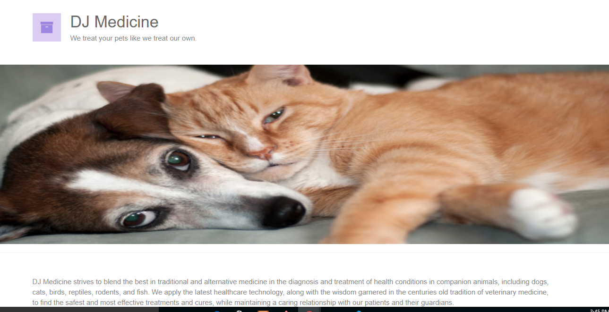
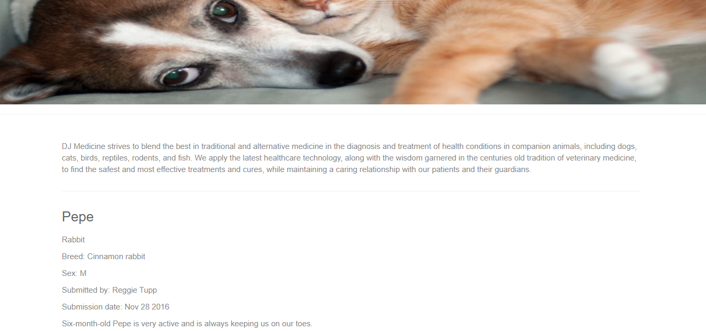
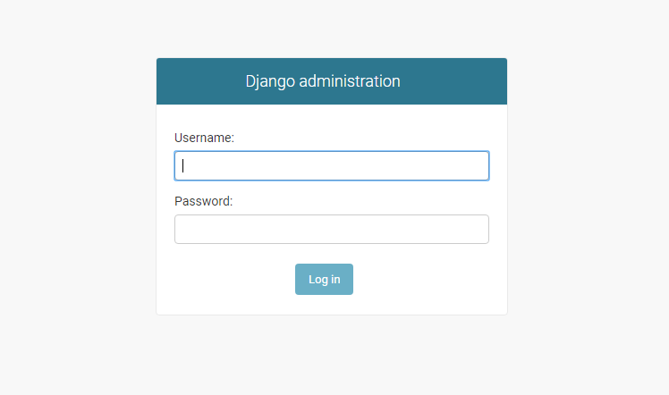
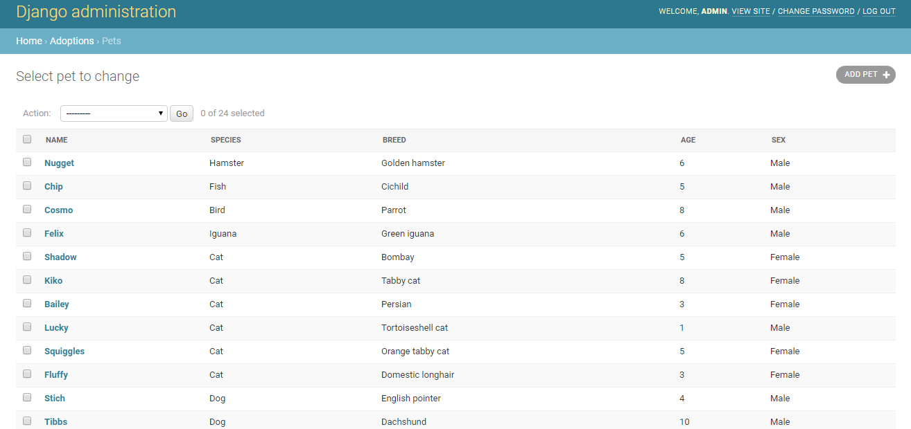

# DJ Medicine
 DJ Medicine is a fictitious brand, solely for the purpose of learning django.
 
 Step 1: Download project and got to the root folder(dj-medicine)
 
 Step 2: Run command `pipenv install`
 
 Step 3: Run command `python manage.py runserver`
 
 **Home Page**
 

 **details Page**
 

Step 4: Goto Admin url

 **Admin**
 
 
 Step 5 : Log in
 
 - Admin user: `admin`
 - Admin Password: `admin1234`
 
  **Pet Detail Page**
 

Credit: [Learning Django](https://www.linkedin.com/learning/learning-django/welcome)
